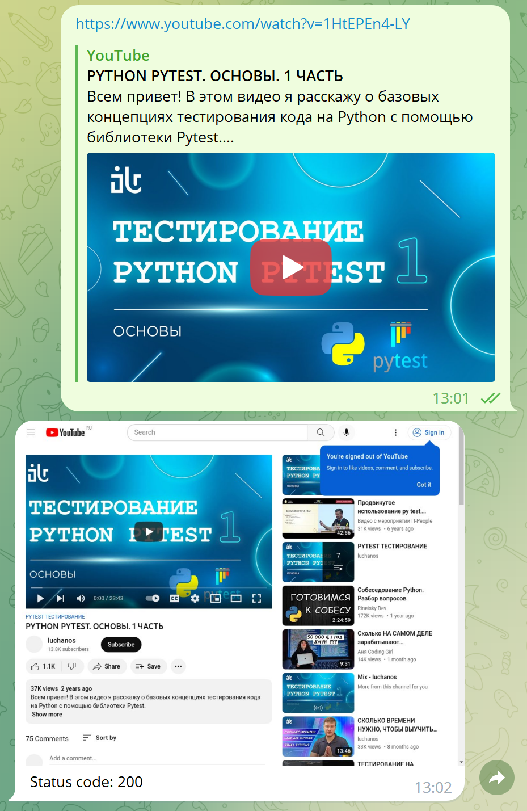

Данный бот можно использовать для проверки работы web страницы: 
* бот переходит по ссылке которую ему отправлена в Телеграм
* делает скриншот страницы 
* отправляет обратно в ответном сообщении скриншот и `Status code`

Инструкция по установке и запуску
1. используя BotFather в telegram создать своего бота
2. создать `.env` по примеру `env.example` и добавить токен своего бота
3. в терминале выполнить `docker-compose up --build`
4. можно пользоваться 